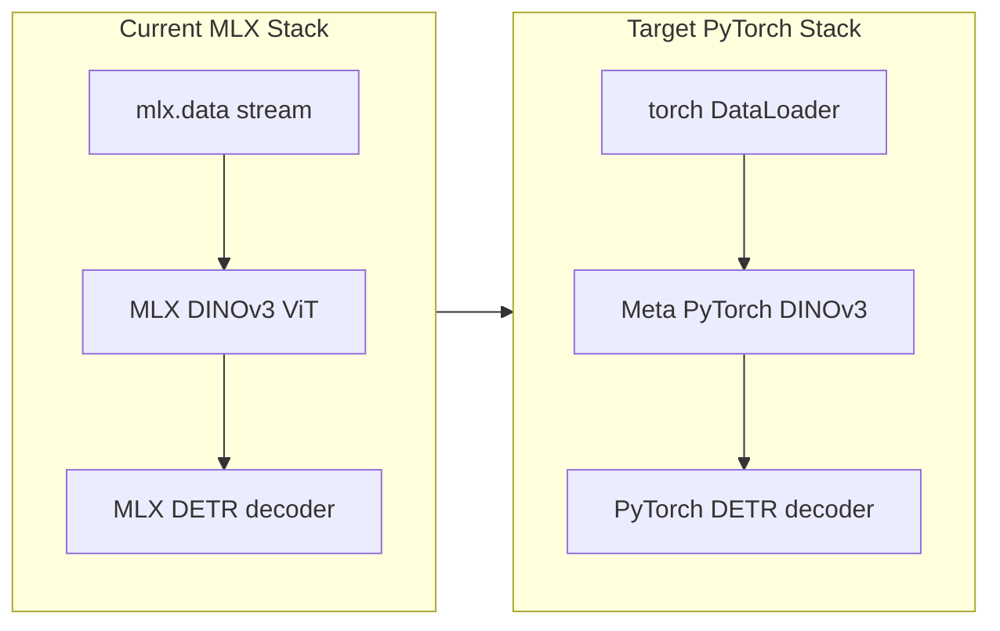

# MLX to PyTorch Migration Plan

## Current State

The project is ~95% MLX (`mlx.core`, `mlx.nn`, `mlx.data`, `mlx.optimizers`) across 19 files (~3,000 LOC). The backbone in [`dinov3/models/vision_transformer.py`](dinov3/models/vision_transformer.py) and [`dinov3/layers/`](dinov3/layers/) is a hand-ported MLX clone of Meta's official code. The DETR detection head in [`heads/detr/`](heads/detr/) consumes `x_norm_patchtokens` from the frozen backbone.

**Good news:** Meta's official PyTorch DINOv3 ([`facebookresearch/dinov3`](https://github.com/facebookresearch/dinov3)) has an almost identical API:

```python
features = model(image, masks=None, is_training=True)
patch_tokens = features["x_norm_patchtokens"]  # (B, N, embed_dim)
```

This means the backbone can be swapped without rewriting architecture logic.



---

## Phase 1: Vendor Meta's Official PyTorch Backbone

**Replace in-place** the MLX backbone files with Meta's official PyTorch sources (same package layout, same import paths). This avoids a submodule and keeps `from dinov3.models import vit_small` working.

| Replace | Source |
|---------|--------|
| [`dinov3/layers/`](dinov3/layers/) (all 8 files) | Meta `dinov3/layers/` |
| [`dinov3/models/vision_transformer.py`](dinov3/models/vision_transformer.py) | Meta `dinov3/models/vision_transformer.py` |
| [`dinov3/utils/utils.py`](dinov3/utils/utils.py) | Meta `dinov3/utils/utils.py` |
| [`dinov3/layers/__init__.py`](dinov3/layers/__init__.py), [`dinov3/models/__init__.py`](dinov3/models/__init__.py) | Meta equivalents |

Skip Meta-only extras not needed for inference (`dino_head.py`, `fp8_linear.py`, `sparse_linear.py`).

**Key layout change:** PyTorch uses **NCHW** `(B, C, H, W)` everywhere. Remove all NHWC transposes currently in [`heads/detr/train.py`](heads/detr/train.py) line 87 and [`heads/detr/inference.py`](heads/detr/inference.py) line 129.

**Add** [`dinov3/utils/device.py`](dinov3/utils/device.py):

```python
def get_device() -> torch.device:
    if torch.cuda.is_available(): return torch.device("cuda")
    if torch.backends.mps.is_available(): return torch.device("mps")
    return torch.device("cpu")
```

**Add** [`dinov3/checkpoints/load.py`](dinov3/checkpoints/load.py) to replace [`dinov3/checkpoints/convert.py`](dinov3/checkpoints/convert.py):
- Load official `.pth` checkpoints directly via `torch.load` + `model.load_state_dict`
- Handle nested keys (`model`, `teacher`, `module.` prefix) — logic already exists in current `convert.py`
- Optional `--verify` against HuggingFace (reuse existing verification pattern)
- Delete `convert.py` after migration

---

## Phase 2: Port DETR Head to PyTorch (~700 LOC)

Port these files from `mlx.nn` / `mlx.core` to `torch.nn` / `torch`:

| File | Key changes |
|------|-------------|
| [`heads/detr/ffn.py`](heads/detr/ffn.py) | Trivial: `nn.Sequential`, `forward()` instead of `__call__` |
| [`heads/detr/transformer.py`](heads/detr/transformer.py) | `nn.ModuleList` for decoder layers (current MLX uses plain list); `torch.sigmoid`; sin-cos pos embed with `torch` ops; register `_pos` as `nn.Buffer` |
| [`heads/detr/deformable_attn.py`](heads/detr/deformable_attn.py) | **Highest risk.** Replace custom `bilinear_sample` with `F.grid_sample` on NCHW tensors `(B, C, H, W)`. Convert sample coords from `[0,1]` to `[-1,1]`. Keep per-head loop initially for correctness |
| [`heads/detr/matcher.py`](heads/detr/matcher.py) | Replace `mx.*` ops with `torch.*`; Hungarian solver already uses NumPy — simplify by calling `.detach().cpu().numpy()` directly (no `.tolist()` bridge) |

**Deformable attention port detail:**

Current MLX flow reshapes memory `(B, H*W, C)` → `(B, H, W, C)` NHWC. PyTorch target:

```python
value = value.reshape(B, h, w, self.n_heads, self.head_dim)
value = value.permute(0, 3, 4, 1, 2)  # (B, nH, hd, H, W)
# grid_sample per head, or reshape to (B*nH, hd, H, W)
```

Use `F.grid_sample(..., mode="bilinear", align_corners=True)` — eliminates ~40 lines of manual indexing.

---

## Phase 3: Port Data Pipeline

Replace [`heads/detr/dataset.py`](heads/detr/dataset.py) `mlx.data` stream with standard PyTorch:

- **`CocoDetectionDataset(torch.utils.data.Dataset)`** — keep existing `letterbox`, `transform_boxes`, lazy image loading logic
- **`make_dataloader(...)`** replacing `make_stream(...)` — returns `(DataLoader, num_batches)`
- Collate function stacks images to `(B, 3, H, W)` float tensors and boxes/labels as lists of tensors (matching current batch dict shape)
- `num_workers=4`, `pin_memory=True` when on CUDA

---

## Phase 4: Port Training and Inference

### [`heads/detr/train.py`](heads/detr/train.py)

| MLX pattern | PyTorch replacement |
|-------------|---------------------|
| `mx.set_default_device(mx.gpu)` | `device = get_device()` |
| `dinov3_small.load_weights(safetensors)` | `load_checkpoint(dinov3_small, "vit-small.pth")` |
| `quantize_model(...)` | **Defer** — train in FP32 initially (see Phase 6) |
| `dinov3_small.freeze()` | `for p in backbone.parameters(): p.requires_grad = False` |
| `nn.value_and_grad` + `optimizer.update` | Standard `loss.backward()` + `optimizer.step()` |
| `mx.eval(...)` | Not needed (eager execution) |
| `detr_decoder.save_weights(safetensors)` | `torch.save(detr_decoder.state_dict(), path)` |

### [`heads/detr/inference.py`](heads/detr/inference.py)

- Load backbone `.pth` and decoder `.pt` state dict
- Image preprocessing: `(1, 3, 224, 224)` NCHW tensor on device
- Replace `mx.softmax` / `.tolist()` with `torch.softmax` / `.cpu().numpy()`
- `model.eval()` + `torch.no_grad()`

### [`dinov3/checkpoints/vits_small.py`](dinov3/checkpoints/vits_small.py)

- Update demo script to PyTorch NCHW input and `.pth` loading

---

## Phase 5: Dependencies and Cleanup

### [`pyproject.toml`](pyproject.toml)

```toml
dependencies = [
    "torch",
    "transformers",   # optional verify only
    "matplotlib",
    "numpy",
    "pillow",
    "scipy",
    "pycocotools",
    "tqdm",
    "pyyaml",
    "safetensors",    # optional, for HF weight loading
]
# REMOVE: mlx
```

### Files to delete

- [`dinov3/checkpoints/convert.py`](dinov3/checkpoints/convert.py) — replaced by `load.py`
- [`dinov3/checkpoints/quantize.py`](dinov3/checkpoints/quantize.py) — MLX-specific; remove or replace in Phase 6

### Files to update

- [`README.md`](README.md) — PyTorch install, NCHW examples, direct `.pth` loading, CUDA/MPS/CPU support
- [`dinov3/configs/config.py`](dinov3/configs/config.py) — add `.to(device)` helper on `build_model()` return

### Attribution

Add note in README that backbone code is vendored from Meta's DINOv3 repo under their license.

---

## Phase 6: Quantization (Deferred)

Current training quantizes both backbone and decoder to 4-bit affine via `mlx.nn.quantize`. For the initial port:

- **Train and infer in FP32** (works on all devices)
- Optionally use `torch.autocast("cuda"/"mps")` for mixed precision
- Follow-up: port quantization using `torch.ao.quantization` or `bitsandbytes` if 4-bit inference is required

This avoids blocking the migration on a non-trivial quantization port.

---

## Weight Migration Strategy

| Asset | Migration path |
|-------|---------------|
| DINOv3 backbone | Load existing `.pth` directly (e.g. `dinov3_vits16_pretrain_lvd1689m-08c60483.pth`) — **no conversion needed** |
| MLX `.safetensors` backbone | No longer needed; use `.pth` source |
| MLX-trained DETR decoder (`detr_decoder_q4.safetensors`) | **Not directly compatible.** Add optional one-time `mlx_to_torch.py` converter OR retrain decoder on PyTorch backbone |

Recommend retraining the DETR head after port (fast — backbone is frozen, only ~3 decoder layers).

---

## Verification Checklist

1. **Backbone smoke test:** Load ViT-S `.pth`, forward `(1, 3, 224, 224)`, assert `x_norm_patchtokens` shape `(1, 196, 384)`
2. **Backbone parity:** Compare CLS embedding against HuggingFace `facebook/dinov3-vits16-pretrain-lvd1689m` (reuse existing verify logic from `convert.py`)
3. **DETR forward:** Random `(B, 196, 384)` input → logits `(B, 100, 92)`, boxes `(B, 100, 4)`
4. **Matcher loss:** Run matcher `__main__` smoke test with torch tensors
5. **Training:** 1 epoch on COCO val2017 — loss decreases, checkpoint saves
6. **Inference:** `inference.py` produces `detr_output.png` with bounding boxes
7. **Device tests:** Confirm runs on CPU; test MPS/CUDA if available

---

## Risk Areas

1. **Deformable attention `grid_sample`** — most complex port; verify gradients flow correctly with a simple overfit test on 1 image
2. **MPS compatibility** — some ops (e.g. `grid_sample`, `linear_sum_assignment`) may need CPU fallback on MPS; wrap Hungarian matching on CPU always
3. **DETR weight incompatibility** — existing MLX-trained decoder weights cannot be loaded; document retraining requirement
4. **Meta code version drift** — pin to a specific Meta dinov3 commit when vendoring

---

## Estimated Effort

| Phase | Scope | Effort |
|-------|-------|--------|
| 1. Backbone vendor | ~10 files replaced | Low (copy + load helper) |
| 2. DETR head port | 4 files | Medium-High |
| 3. Data pipeline | 1 file | Medium |
| 4. Train/inference | 3 files | Low-Medium |
| 5. Cleanup/docs | pyproject, README | Low |
| 6. Quantization | deferred | — |

**Total: ~1,200 LOC to write/modify**, ~2,000 LOC deleted/replaced from MLX backbone.
